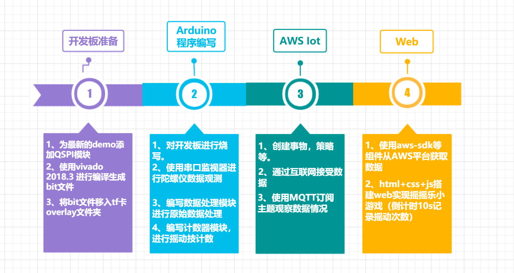
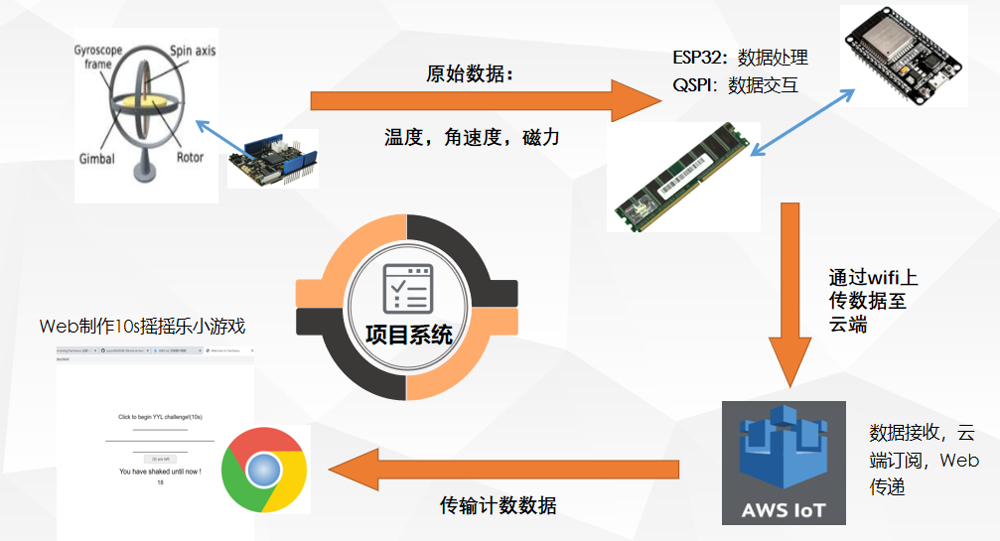

#### 中文|[English](README_en.md)
# 这是FLY小队的项目
# 2020年新工科联盟-[Xilinx](https://www.xilinx.com/)暑期学校（Summer School）项目
# 队伍名称：FLY的傅里叶
## 小组成员 ： 强浩   李高鉴
## 项目名称：A13 摇摇乐
## 拓展功能：搭建Web实现与AWS的数据传输，同时基于计数器在Web实现“10s摇摇乐挑战”小游戏
## 工具版本(点击下载)：[Vivado 2018.3（VerilogHDL)](https://china.xilinx.com) ， [Arduino1.8.9(C,C++)](https://www.arduino.cc/en/Main/Software)，[AWS Iot](https://aws.amazon.com/tw/education/awseducate/) ，[Vscode(html，css，JavaScript)](https://code.visualstudio.com/)
## 板卡型号：xc7s15ftgb196-1
## 外设：无

title: 开发板 +AWS +Web 实现摇摇乐计数小游戏：“是男人就摇10s!”

# 起飞！！！
---
## 项目流程图

---
## 项目概要 
---
### 开发板准备
1. 为最新的[FPGADemo](https://github.com/DoneSEA/SEA)添加QSPI模块，支持串口数据输出。
For the latest [FPGADemo] (https://github.com/DoneSEA/SEA) to add QSPI module, support serial data output.
2. 使用[Vivado 2018.3](https://china.xilinx.com)进行编译生成bit文件。
3. 将bit文件移入tf卡的overlay文件夹
### Arduino程序编写
1. 对开发板进行烧写。
2. 使用串口监视器进行陀螺仪原始数据进行观测。
3. 编写数据处理模块处理原始数据。
4. 编写计数器模块进行摇动计数。
### [AWS Iot](https://www.awseducate.com)
1. 创建事物、策略等。
2. 通过互联网接收数据。
3. 使用MQTT订阅主题观察数据情况。
### Web
1. 使用aws SDK等组件从AWS平台获取数据。
2. HTML+CSS+js搭建web实现摇摇乐小游戏。

---
## 技术路线

---
示例演示

---
## 仓库目录介绍
---
### images
1. 项目流程框图
2. 项目过程截图
3. 作品照片

### Sourcecode
1. FPGA源码
2. ESP32源码
3. Web源码

### ExecutableFiles
1. bit文件
2. ESP32可执行文件
