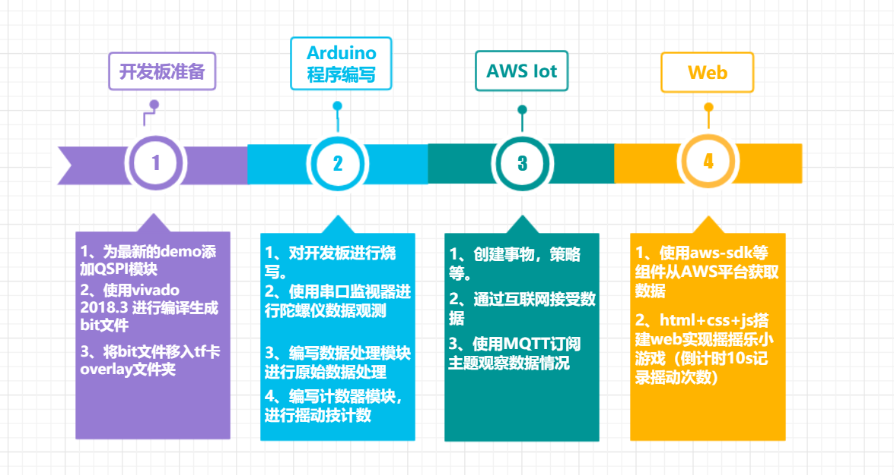
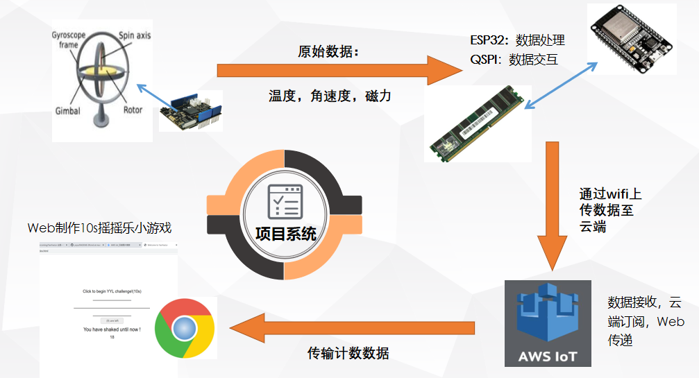

#### English | [Chinese](README.md)

# This is for FLY's FuLiYe new project

# 2020 New Engineering Alliance -[Xilinx](https://www.xilinx.com/) Summer School Project

# Team name: Fourier of FLY

## Team member: Qiang Hao Li Gaojian

## Project name: A13 Yo-yo

## Extension function: Build Web to realize data transmission with AWS, and realize the small game of "shake 10s of challenge" on the Web based on the counter

## Tool version (click to download) : [Vivado 2018.3 (VerilogHDL)](https://china.xilinx.com), [Arduino1.8.9 (C, C + +)](https://www.arduino.cc/en/Main/Software), [AWS Iot](https://aws.amazon.com/tw/education/awseducate/), [Vscode (HTML, CSS, JavaScript)](https://code.visualstudio.com/)

## Model: XC7S15FTGB196-1

## Peripheral: None

Title: Development board +AWS +Web to realize the little game of yo-yo counting: "Shake 10s if you are a man!"

# Let 's Go

---
## Project flowchart

---
## Project overview

---

### Development board ready

1. For the latest [FPGADemo](https://github.com/DoneSEA/SEA) to add QSPI module, support serial data output.

2. Use [Vivado 2018.3](https://china.xilinx.com) to compile and generate bit files.

3. Move the BIT file into the TF card overlay folder

Arduino programming

1. Burn and write the development board.

2. Use the serial port monitor to observe the original data of the gyroscope.

3. Compile the data processing module to process the original data.

4. Write the counter module for shaking count.

### [AWS Iot](https://www.awseducate.com)

1. Create things, strategies, etc.

2. Receive data over the Internet.

3. Subscribe to topics to observe the data using MQTT.

### Web

1. Use AWS SDK and other components to obtain data from AWS platform.

2. HTML+CSS+ JS to build the Web to achieve the small game of Yo-yo.

---

## Technical route

---

## Example demo

---

---

## Introduction to the warehouse directory

---

### images

1. Project flow diagram

2. Project process screenshot

3. Photographs of works

### Sourcecode

1. The FPGA source

2. ESP32 source code

3. The Web source

### ExecutableFiles

1. Bit file

2. ESP32 executable
